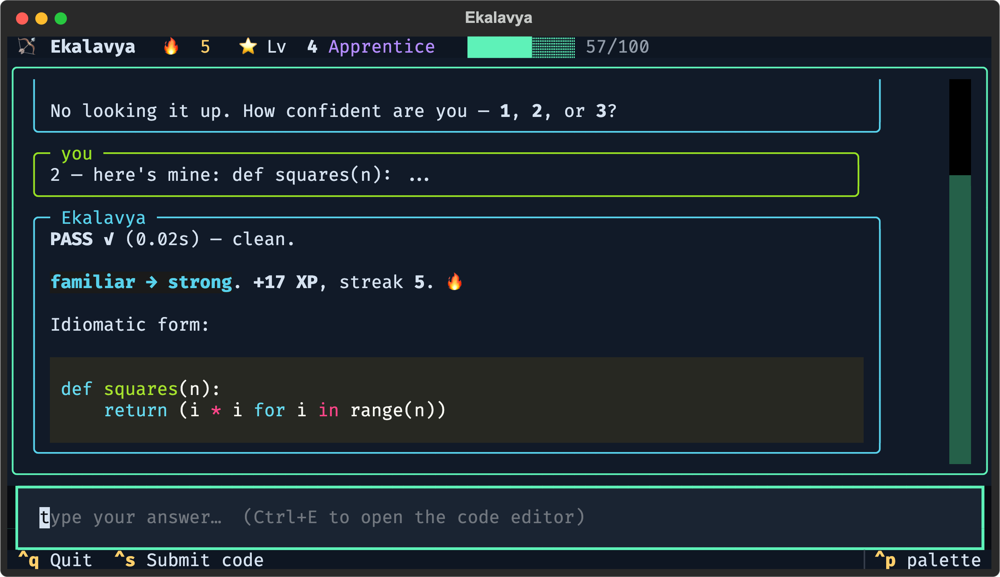
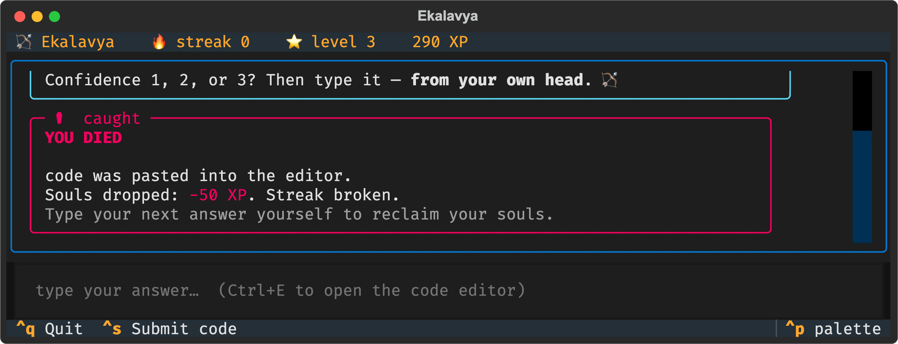
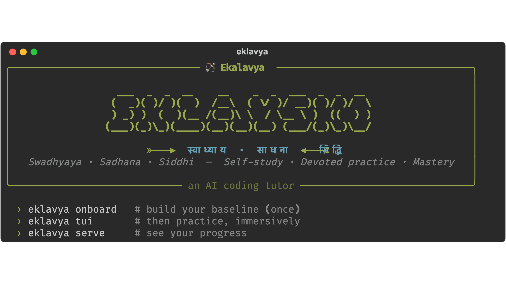

# Ekalavya 🏹

**A coding tutor that lives in your terminal and makes you *earn* the answer.**

> स्वाध्याय · साधना · सिद्धि — *self-study · devoted practice · mastery*

I built this because AI quietly took the joy out of coding for me. The good part
of programming was always the struggle — wrestling a hard problem for hours until
it finally clicks. Reaching for an assistant every time skips the struggle, and
the struggle was where the learning lived. Ekalavya is my attempt to get that
back: it teaches Socratically, drills me daily, tracks what I actually know, and
refuses to just hand me the solution.

It's named after the self-taught archer from the Mahābhārata who reached mastery
alone, through sheer devotion — no teacher handing him anything.

<p align="center">
  
</p>

## What it does

- **Onboards you once** — a Socratic interview that figures out where you're
  strong, where you're weak, and what you're actually trying to build, then saves
  a profile it improves over time.
- **Drills you daily** — small, gated exercises aimed at your weakest spots. You
  state your confidence *first*, then attempt it yourself. Your code runs in a
  sandbox and is graded against hidden tests.
- **Remembers with spaced repetition** — concepts come back exactly when you're
  about to forget them (FSRS).
- **Scores calibration, not just correctness** — being confident *and wrong* (the
  illusion of knowing) costs you far more than an honest "I'm not sure." That's
  the signal that actually moves you forward.
- **Won't let you cheat** — the built-in editor is where you write code. Paste an
  answer from an AI and you *die*, Souls-style: souls dropped, streak broken. You
  reclaim the dropped souls only by typing the next one yourself.
- **Simulates take-home assignments** — a demanding, scoped brief like the ones
  top companies send, then reviews your submission like a senior engineer.
- **Learns from your real code** — point it at a repo you work on and it tailors
  your practice to the frameworks you actually use.
- **Shows your progress** — a mastery heatmap, streak, level, and XP.

## Screenshots

| Practice (TUI) | Progress dashboard |
|---|---|
|  |  |

Paste an answer from an AI, and:

<p align="center">
  
</p>

<p align="center">
  
</p>

## Getting started

Needs Python 3.11+ and [uv](https://docs.astral.sh/uv/). It talks to any
Anthropic-compatible model endpoint — I use GLM and MiniMax.

```bash
uv sync --extra agent --extra tui --extra web
cp .env.example .env          # add a key (GLM and/or MiniMax)
uv run eklavya doctor         # check the setup
uv run eklavya onboard        # one-time — builds your baseline
uv run eklavya tui            # then practice
```

## Commands

| Command | What it does |
|---|---|
| `eklavya` | Just run it — onboards you on the first run, else drops into practice |
| `eklavya onboard` | One-time Socratic interview → your baseline mastery map |
| `eklavya tui` | The immersive terminal UI, with a built-in code editor |
| `eklavya practice --minutes N` | A plain-CLI practice session |
| `eklavya mock --minutes N` | A mock technical interview with an honest scorecard |
| `eklavya takehome --minutes N` | A simulated company take-home, reviewed like the real thing |
| `eklavya serve` | A local web dashboard of your progress |
| `eklavya scan PATH` | Tailor your pillars to a repo you work on (asks first) |
| `eklavya mcp` | Run as an MCP server so another agent can drive your practice |
| `eklavya doctor` | Check Python, dependencies, providers, and state |

Inside any session, type `/` for commands (`/help`, `/stats`, `/goals`, `/exit`) — prefixes work, like the agents you already use.

## Drive it from another agent (MCP)

Ekalavya can run as an [MCP](https://modelcontextprotocol.io) server, exposing its
spine (progress, focus suggestions, sandboxed grading, spaced-repetition recording)
as tools. Point a coding agent at it and *that* agent becomes the tutor brain while
Ekalavya keeps the state. For Claude Code:

```bash
claude mcp add ekalavya -- eklavya mcp
```

or in an `.mcp.json`:

```json
{ "mcpServers": { "ekalavya": { "command": "eklavya", "args": ["mcp"] } } }
```

## How it works

The teaching brain is an agent (built on
[deepagents](https://github.com/langchain-ai/deepagents) / LangGraph). Everything
that has to be reliable — running code, grading, ratings, spaced-repetition
scheduling, streaks — is plain Python the agent calls as tools. The agent decides
*when*; the tools decide *what actually happens*, so your record never depends on
a model remembering. State lives locally in SQLite; the learner profile is a
markdown file you can read.

## Why it works — the science

Ekalavya isn't just gamified drills; every design choice traces to the learning-science
literature. The core bet is counterintuitive but well established: **AI that hands you
answers quietly erodes real skill, while AI that forces you to retrieve and reason builds
it.**

- **Giving answers hurts durable learning.** In a randomized trial (~1,000 students),
  unrestricted GPT-4 raised *assisted* practice scores by **+48%** but dropped *unaided*
  exam performance by **−17%** vs. controls — cognitive offloading feels productive and
  isn't ([Bastani et al., 2025](https://arxiv.org/pdf/2605.21629)). This is the whole
  reason Ekalavya makes you earn it (and penalises pasted code).
- **A well-designed tutor beats even great teaching.** A Harvard RCT (N=194) found a
  Socratic, scaffolded AI tutor made students learn **significantly more in less time**
  than an active-learning classroom — and feel more engaged
  ([Kestin et al., *Nature* 2025](https://www.nature.com/articles/s41598-025-97652-6)).
- **Retrieval practice + spacing are the most effective techniques**, and they *transfer*
  to new problems (retrieval beat rereading by **~24%** on transfer)
  ([Dunlosky et al.](https://www.kent.edu/psychology/all-study-strategies-not-created-equal-according-kent-state-researchers),
  [Nature Reviews Psychology](https://www.nature.com/articles/s44159-022-00089-1)).
  So Ekalavya schedules reviews with **FSRS** and makes you reproduce solutions from
  memory rather than reread them.
- **Worked examples help novices but slow experts** (the expertise-reversal effect), so
  Ekalavya shows the idiomatic solution as a reward for *new/weak* concepts and withholds
  it once you're strong ([worked-example effect](https://en.wikipedia.org/wiki/Worked-example_effect)).
- **The illusion of knowing is the key signal**, so confident-and-wrong costs you far more
  than an honest "I'm not sure."

It also bakes in **self-explanation**, **elaborative interrogation** ("why is this right?"),
**interleaving** of old and new, and pushes past recall toward analysis and creation —
the methods the evidence supports, and the ones that *feel* hard because they're the ones
that work.

## Running the tests

```bash
uv run pytest        # fast, offline, no API key needed
```

There are also a few live checks under `scripts/` that hit a real model to verify
the providers and the end-to-end grading loop.

## License

MIT
