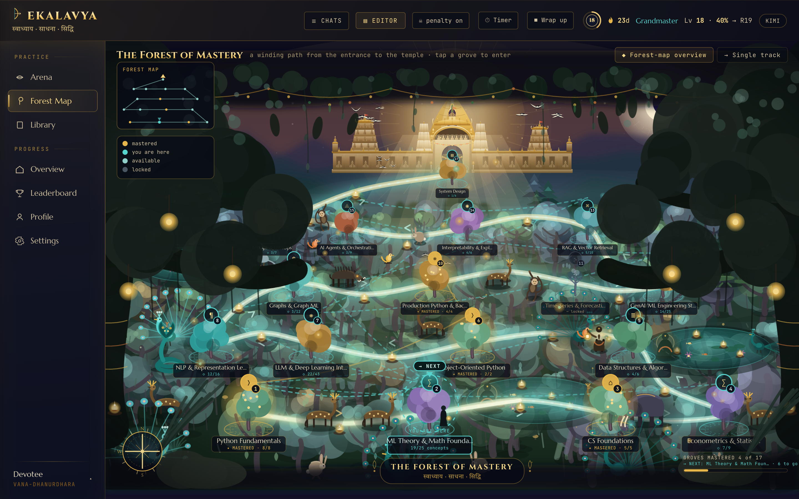
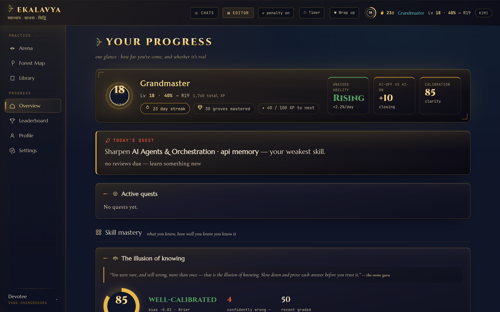
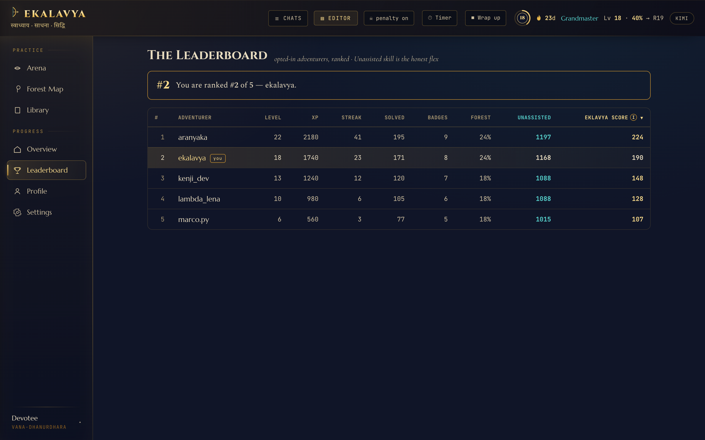
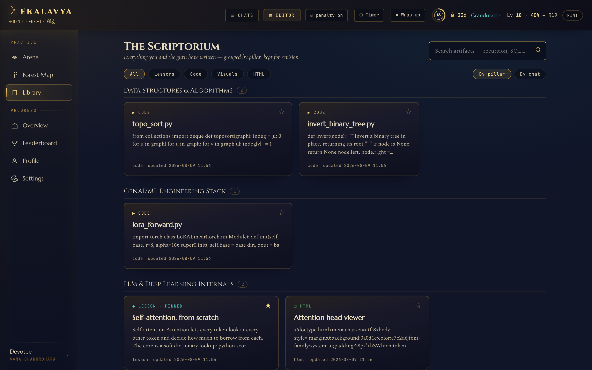
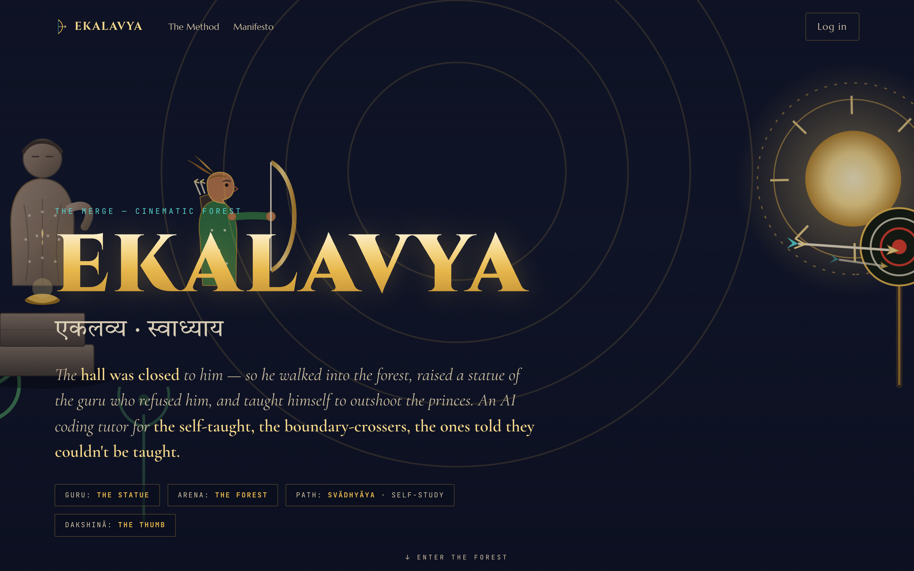
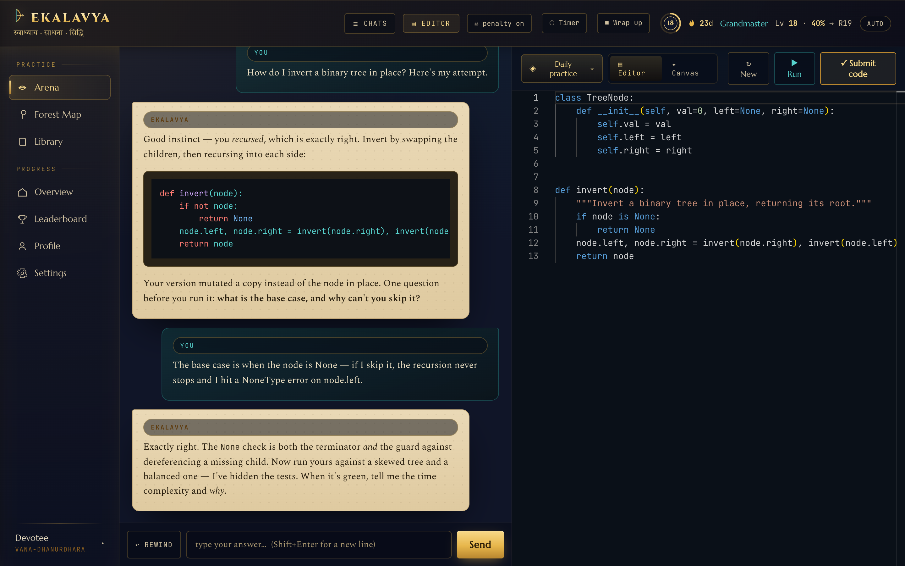
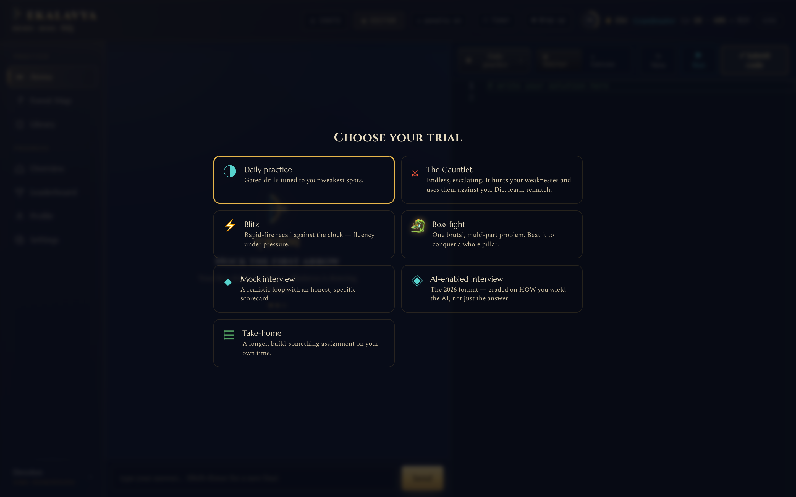
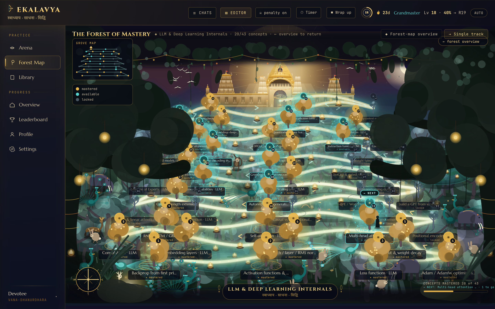
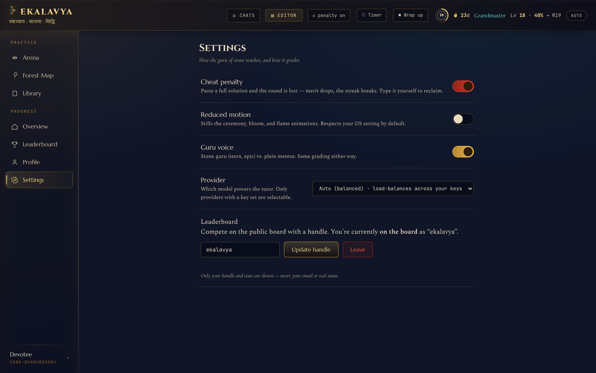

# Ekalavya 🏹

**An agentic AI coding tutor that teaches you, tests you, and refuses to let your skills atrophy.**

> स्वाध्याय · साधना · सिद्धि — *self-study · devoted practice · mastery*

<p align="center">
  
</p>

<p align="center">
  
  
  
  
  
</p>

## What it is

Ekalavya is a coding-and-learning tutor built on a **LangGraph agent** that teaches you Socratically, drills you daily on your weakest spots, grades your code in a **sandbox against hidden tests**, and tracks the one metric that actually matters: **what you can do *unaided***. It runs as a browser app (`eklavya serve`), an immersive terminal UI (`eklavya tui`), or an **MCP server** any coding agent can drive.

It's named after the self-taught archer from the Mahābhārata — an outsider who was turned away from the school and mastered the craft alone in the forest. (More on why, below.)

## The philosophy — honest, unassisted skill

I built this because AI quietly took the joy out of coding for me. The good part of programming was always the struggle — wrestling a hard problem until it clicks. Reaching for an assistant every time skips the struggle, and the struggle was where the learning lived.

There's now hard evidence this isn't just nostalgia: an AI that **hands you answers** measurably erodes real ability, while an AI that **forces you to retrieve and reason** builds it. So Ekalavya is deliberately built as the second kind. It tracks your **AI-off ability** as the headline number, gates the illusion of knowing, and — Souls-style — penalises pasted answers. Anti-atrophy is the whole point.

## Features

- 🧠 **Agentic tutor on LangGraph deepagents** — the teaching brain is an agent; everything that must be reliable (running code, grading, ratings, scheduling, streaks) is plain Python it calls as tools. The agent decides *when*; the tools decide *what actually happens*, so your record never depends on a model remembering.
- 🔒 **Tamper-proof grading** — your code runs in a **sandbox** against hidden tests, with deterministic graders for code/output, symbolic equivalence (SymPy) for maths, and a rubric judge for open-ended work. The tutor must supply a reference solution that passes its own tests *before* you're graded — so it can't fake an outcome or grade you against broken tests.
- 🌳 **The Forest of Mastery** — a living skill-tree map, drawn live from your curriculum + attempts. Groves blossom as you master them, one lights up as your active focus, and a winding path climbs toward the temple. Not decoration: it *is* your progress.
- 📐 **Effectiveness / IRT benchmark** — a **frozen item bank the tutor never teaches from** yields a stable ability score (Rasch/1PL θ) — the non-circular "am I really improving?" ruler, separate from the drills.
- 📉 **AI-off vs AI-on gap tracking** — every attempt is tagged unaided or assisted, so you can watch your *unaided* accuracy trend and whether the gap is *closing*. The guardrail against dependency.
- ⚖️ **Multi-provider with failover + load-balancing** — GLM, MiniMax, Qwen, and Kimi (all Anthropic-compatible). Set several keys and a session auto-fails-over if one is down; flip `EKLAVYA_BALANCE=1` to spread new sessions round-robin.
- 🎮 **Game modes** — mock interviews, simulated company take-homes reviewed like the real thing, an "AI-allowed" interview (the assistant is deliberately imperfect — you're scored on how well you *use and verify* it), plus blitz/gauntlet/boss drills.
- 📚 **Artifacts library** (the Scriptorium) — durable lessons, code, HTML, and visuals the tutor authors, grouped by pillar and kept for you.
- 👥 **Multi-user with per-user isolation** — each account gets its own SQLite home; a user's workspace can never read another's data or the account table.
- 🏆 **Opt-in leaderboard with the Eklavya Score** — a privacy-safe board (public handle only, never email/name) ranking opted-in learners by a transparent composite: 40% unassisted skill · 20% mastery · 20% XP · 10% streak · 10% achievements.

### One glance at your progress

The **Overview** is a single bento dashboard — rank ring, streak, groves mastered, and the credibility trio (unaided trend, AI-off↔AI-on gap, calibration clarity):

<p align="center">
  
</p>

The **leaderboard** ranks opted-in learners on honest, unassisted skill — with sortable columns for Unassisted rating and the Eklavya Score, and your own row highlighted:

<p align="center">
  
</p>

The **Scriptorium** keeps everything the tutor authors — lessons, code, visuals — grouped by pillar:

<p align="center">
  
</p>

The whole thing lives behind an Apple-style scroll landing — the forest scene fixed, a glassmorphic sign-in card sliding up over it:

<p align="center">
  
</p>

## Why "Ekalavya"?

In the Mahābhārata, Ekalavya was a forest-dwelling Bhil boy who wanted to learn archery from Droṇa, the greatest teacher of the age. Droṇa turned him away — not for any lack of skill, but for *where he came from*: a tribal outsider, not a highborn prince. So Ekalavya went into the forest, shaped a clay statue of the guru who had refused him, and taught himself before it with such devotion that he surpassed the royal students who *were* let in. (The story ends in sacrifice — asked for his right thumb as the teacher's fee, he gave it without hesitation.)

I keep coming back to that story because I'm an outsider to this field too — my degrees are in economics, not computer science, and the formal doors stay mostly closed to someone with that background, however much of the work I've already shipped. So I'm doing what Ekalavya did: teaching myself the thing I was told I couldn't be taught. **This tool is for anyone in that position — the career-changers, the self-taught, the boundary-crossers learning it in the forest because the hall was closed to them.**

## Also in the box

- A one-time **Socratic onboarding** that maps where you're strong, where you're weak, and what you're building.
- **Spaced repetition (FSRS)** so concepts come back exactly when you're about to forget them.
- **Calibration scoring** — being confident *and wrong* (the illusion of knowing) costs you far more than an honest "I'm not sure."
- **Learns from your real code** — point it at a repo (`eklavya scan PATH`) and it tailors your practice to the frameworks you actually use.
- **Visual explanations** — Mermaid flowcharts/sequence/class/state diagrams and KaTeX maths, rendered inline.

The **Arena** — a Socratic conversation on one side, a real code editor on the other. The tutor probes instead of hands over answers; you write the code and run it against hidden tests:

<p align="center">
  
</p>

<table>
<tr>
<td width="50%"><br><sub><b>Choose your trial</b> — daily practice, the Gauntlet, Blitz, Boss fights, mock + AI-enabled interviews, take-homes.</sub></td>
<td width="50%"><br><sub><b>Drill into a grove</b> — one pillar's full concept chain, prereq-ordered along the path.</sub></td>
</tr>
<tr>
<td><br><sub><b>Settings</b> — pick a provider or Auto (load-balanced), and opt into the leaderboard with a handle.</sub></td>
<td><br><sub><b>Anti-cheat</b> — paste an AI's answer and the round is lost, Souls-style; type it yourself to reclaim your merit.</sub></td>
</tr>
</table>

## Architecture

```
                    ┌──────────────────────────────────────┐
   Browser  ───────▶│  FastAPI / Starlette SPA (webapp.py)  │
   TUI (Textual) ──▶│  · per-request tenant isolation       │
   MCP client   ───▶│  · signed-cookie auth (deployed)      │
                    └───────────────┬──────────────────────┘
                                    │
                    ┌───────────────▼──────────────────────┐
                    │  LangGraph deepagents (agent.py)      │  the teaching brain — decides WHEN
                    │  tamper-proof tools (tools.py)        │  the tools decide WHAT (grade, rate,
                    │  sandbox · graders · FSRS · Elo/IRT   │  schedule) — reliably, in plain Python
                    └───────────────┬──────────────────────┘
                                    │
        ┌───────────────────────────┼───────────────────────────┐
        ▼                           ▼                           ▼
  Provider layer            Per-user SQLite              Frozen benchmark
  (providers.py)            $DATA_ROOT/users/<id>/       (never taught from)
  GLM·MiniMax·Qwen·Kimi     eklavya.db + profile.md      θ ability ruler
  failover + balancing
```

State lives locally in SQLite (one home per user); the learner profile is a markdown file you can read. Anything Anthropic-compatible plugs into the provider layer.

## Quickstart

Needs **Python 3.11+** and [uv](https://docs.astral.sh/uv/). It talks to any Anthropic-compatible model endpoint — bring at least one provider key (GLM and/or MiniMax work great).

```bash
uv sync --extra agent --extra tui --extra web
cp .env.example .env          # add ONE provider key (e.g. EKLAVYA_GLM_API_KEY=...)
uv run eklavya doctor         # check Python, deps, providers, and state
uv run eklavya onboard        # one-time Socratic interview → your baseline
uv run eklavya serve          # the full web app → http://127.0.0.1:4646
# ...or stay in the terminal:
uv run eklavya tui
```

### Commands

| Command | What it does |
|---|---|
| `eklavya` | Just run it — onboards you on first run, else drops into practice |
| `eklavya serve` | The full web app (practice, editor, forest map, progress) — no terminal needed |
| `eklavya tui` | The immersive terminal UI, with a built-in code editor |
| `eklavya onboard` | One-time Socratic interview → your baseline mastery map |
| `eklavya practice --minutes N` | A plain-CLI practice session |
| `eklavya mock --minutes N` | A mock technical interview with an honest scorecard |
| `eklavya takehome --minutes N` | A simulated company take-home, reviewed like the real thing |
| `eklavya assess` | An AI-off sitting on the frozen benchmark → your ability score θ |
| `eklavya scan PATH` | Tailor your pillars to a repo you work on (asks first) |
| `eklavya mcp` | Run as an MCP server so another agent can drive your practice |
| `eklavya doctor` | Check Python, dependencies, providers, and state |

Inside any session, type `/` for commands (`/help`, `/stats`, `/goals`, `/exit`) — prefixes work, like the agents you already use.

### Providers

All four speak the Anthropic API, so one client handles any of them — just a different base URL + token.

| Provider | Env var | Default model |
|---|---|---|
| GLM (z.ai) — default | `EKLAVYA_GLM_API_KEY` | `glm-5.2` |
| MiniMax | `EKLAVYA_MINIMAX_API_KEY` | `MiniMax-M3` |
| Qwen (Alibaba) | `EKLAVYA_QWEN_API_KEY` | `qwen3.8-max-preview` |
| Kimi (Moonshot) | `EKLAVYA_KIMI_API_KEY` | `k3` |

Set **one** and it just works. Set **several** and a session automatically fails over to the next configured provider if one is down or rate-limited. Add **`EKLAVYA_BALANCE=1`** to also spread *new* sessions round-robin across providers (entry load-balancing); the failover chain is always on regardless.

### Drive it from another agent (MCP)

Ekalavya can run as an [MCP](https://modelcontextprotocol.io) server, exposing its spine (progress, focus suggestions, sandboxed grading, spaced-repetition recording) as tools. Point a coding agent at it and *that* agent becomes the tutor brain while Ekalavya keeps the state. For Claude Code:

```bash
claude mcp add ekalavya -- eklavya mcp
```

or in an `.mcp.json`:

```json
{ "mcpServers": { "ekalavya": { "command": "eklavya", "args": ["mcp"] } } }
```

## Self-host / deploy

Two postures, one codebase — they differ only by config:

- **Local self-host (default)** — a frictionless single account, no login ceremony.
- **Multi-user (hosted)** — `EKLAVYA_DEPLOYED=1` turns on full email+password auth, tenant-confined file reads, and the opt-in leaderboard. Behind nginx + certbot (HTTPS) with a systemd unit; the app port stays private.

The full walkthrough (systemd, nginx, certbot, backups, sandbox hardening) is in **[docs/DEPLOY.md](docs/DEPLOY.md)**.

## Configuration reference

Every variable is optional except a provider key. Full annotated list in [`.env.example`](.env.example).

| Variable | Purpose | Default |
|---|---|---|
| `EKLAVYA_GLM_API_KEY` / `EKLAVYA_MINIMAX_API_KEY` / `EKLAVYA_QWEN_API_KEY` / `EKLAVYA_KIMI_API_KEY` | Provider credentials (set ≥1) | — |
| `EKLAVYA_PROVIDER` | Default provider to teach with | `glm` |
| `EKLAVYA_BALANCE` | Round-robin new sessions across providers | off |
| `TAVILY_API_KEY` / `SERPER_API_KEY` | Web search for fresh interview questions | off |
| `EKLAVYA_VERIFY` | Self-check hallucination judge | on |
| `EKLAVYA_DATA_ROOT` | Where all state lives (parent of `users/`) | `~/.eklavya-data` |
| `EKLAVYA_DEPLOYED` | Hosted posture: full auth + isolation | off |
| `EKLAVYA_SECRET_KEY` | Signs session cookies (**required** when deployed) | — |
| `EKLAVYA_SIGNUP_APPROVAL` | New signups need owner approval | off |
| `EKLAVYA_TRUST_PROXY` | Trust `X-Forwarded-For` (behind a trusted proxy only) | off |

## Tech stack

FastAPI / Starlette · [LangGraph](https://github.com/langchain-ai/langgraph) + [deepagents](https://github.com/langchain-ai/deepagents) · LangChain (Anthropic-compatible clients) · SQLite (per-user) · [FSRS](https://github.com/open-spaced-repetition) spaced repetition · SymPy graders · Textual (TUI) · Typer + Rich (CLI) · argon2 password hashing · vanilla-JS SPA (Chart.js, KaTeX, marked, DOMPurify).

## Why it works — the science

Ekalavya isn't just gamified drills; every design choice traces to the learning-science literature. The core bet is counterintuitive but well established: **AI that hands you answers quietly erodes real skill, while AI that forces you to retrieve and reason builds it.**

- **Giving answers hurts durable learning.** In a randomized field experiment (~1,000 students), an unrestricted GPT-4 tutor raised *assisted* practice performance by ~48% but dropped *unaided* exam scores by **~17%** vs. controls — while a *safeguarded* tutor that gives hints instead of answers kept the gains **without** the harm ([Bastani et al., 2024](https://papers.ssrn.com/sol3/papers.cfm?abstract_id=4895486)). That safeguarded design is exactly what Ekalavya is (and why it penalises pasted code).
- **A well-designed tutor beats even great teaching.** A Harvard RCT (N=194) found a Socratic, scaffolded AI tutor made students learn **significantly more in less time** than an active-learning classroom — and feel more engaged ([Kestin et al., *Nature* 2025](https://www.nature.com/articles/s41598-025-97652-6)).
- **Retrieval practice + spacing are the most effective techniques**, and they *transfer* to new problems (retrieval beat rereading by **~24%** on transfer) ([Dunlosky et al.](https://www.kent.edu/psychology/all-study-strategies-not-created-equal-according-kent-state-researchers), [Nature Reviews Psychology](https://www.nature.com/articles/s44159-022-00089-1)). So Ekalavya schedules reviews with **FSRS** and makes you reproduce solutions from memory rather than reread them.
- **Worked examples help novices but slow experts** (the expertise-reversal effect), so Ekalavya shows the idiomatic solution as a reward for *new/weak* concepts and withholds it once you're strong ([worked-example effect](https://en.wikipedia.org/wiki/Worked-example_effect)).
- **The illusion of knowing is the key signal**, so confident-and-wrong costs you far more than an honest "I'm not sure."

It also bakes in **self-explanation**, **elaborative interrogation** ("why is this right?"), **interleaving** of old and new, and pushes past recall toward analysis and creation — the methods the evidence supports, and the ones that *feel* hard because they're the ones that work.

## Running the tests

```bash
uv run pytest        # fast, offline, no API key needed
```

There are also a few live checks under `scripts/` that hit a real model to verify the providers and the end-to-end grading loop.

## License

[MIT](LICENSE) © Govind Mittal
